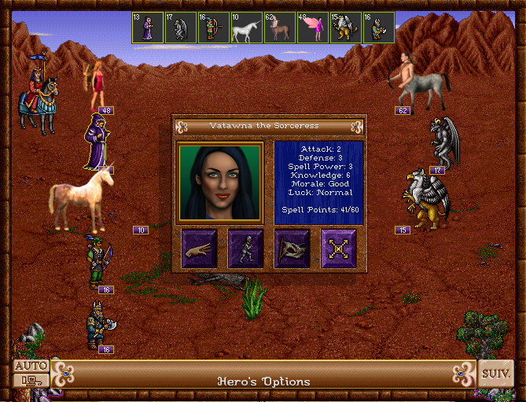

# fheroes2 : War of Thrones

This project aim is to provide "libre" artwork for the game engine [fheroes2](https://sourceforge.net/projects/fheroes2).

Main screen of fheroes2-WoT :

fheroes2 with the original artwork :

fheroes2 with some artwork replaced :

## How to use it?

First, allow the use of alternative data in configuration file `fheroes2.cfg`.
This file must contents the line :

> alt resource = on

Then copy the `files` directory in the same place as the fheroes2 executable.

The next time you will launch the game, the alternate resources will be used instead of the original one when there are available.

Most of the original resources are still used because there are few libre artwork.

## Where the alternative artwork comes from?

I have collect some resources from the free game `Attal : lords of doom` which is now unmaintained.
The web site of this game is not still alive. But the artwork remain under GPL license.

Some resources were taken from [Wesnoth](http://wesnoth.org), or from [OpenGameArt](http://opengameart.org).

For more informations read `[files/images/AUTHORS](files/images/AUTHORS)` file.

### Licence

File's licences are detailled in file `[AUTHORS](files/images/AUTHORS)`.

If a file is not listed, it is my own work, with licence CC0 (Public Domain).

If you want to contribute with artwork you have done, Let me know what Licence you want (must be open) for your file, or add a modification of file AUTHOR in your pull request.

## Website

To learn more on this project read [the official website](http://thaddeus002.github.io/fheroes2-WoT/index.html)
